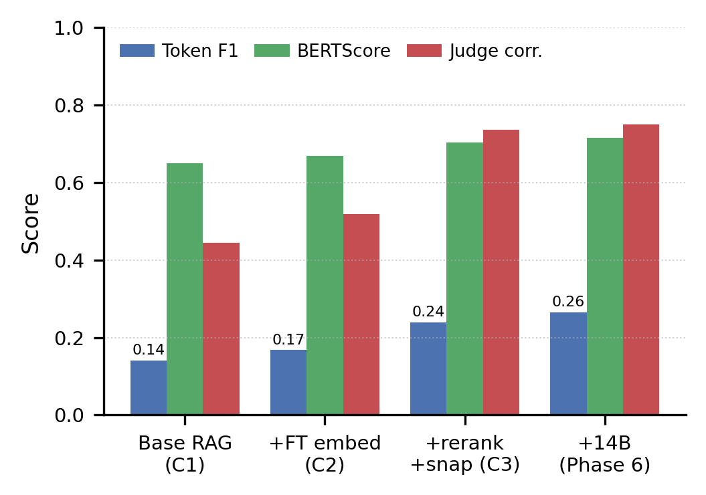

# Turkish Legal RAG

A domain-adapted **Retrieval-Augmented Generation** system for Turkish legal question
answering: hybrid dense + lexical retrieval, cross-encoder reranking, verbatim-snap
post-processing, and a quantized Qwen-2.5 generator — built around a controlled component
ablation and a focus on reproducible, statistically-tested results.

[](LICENSE)


📄 **[Read the paper → `reports/final_report.pdf`](reports/final_report.pdf)**

## Highlights

Holding the generator fixed (Qwen-7B), the fine-tuned pipeline beats a naive baseline by a
large, statistically significant margin on a 225-question gold set verified against official
statute text; an optional 14B generator adds a further gain.



| Metric | Base RAG | Fine-tuned RAG (7B) | + 14B (optional) |
|---|---:|---:|---:|
| Token F1 | 0.1411 | **0.2386** (+69.1%) | 0.2648 (+87.7%) |
| BERTScore-F1 | 0.650 | 0.703 | 0.716 |
| LLM-judge correctness | 0.444 | 0.736 | 0.750 |
| Hallucination rate | — | 17.0% | **8.95%** |

- **Base vs. Fine-tuned, same LLM:** +69.1% Token F1 (Wilcoxon *p* < 0.001, non-overlapping 95% CIs).
- **Retrieval:** Recall@10 0.875 (3-corpus hybrid + reranker).
- **Rigor:** bootstrap 95% CIs, Wilcoxon paired tests, and an LLM-judge validated against an independent judge.
- **Bring-your-own-data:** runs end-to-end on an arbitrary Turkish legal corpus and benchmark.

See the [paper](reports/final_report.pdf) for the full methodology, component ablation,
negative results, and limitations.

## Quickstart

The system runs end-to-end on any Turkish legal corpus and any Q&A benchmark — point the CLI
at your own data and get scored results back.

```bash
# 1. Install
pip install -r requirements.txt

# 2. Index your corpus (directory of PDF/.txt/.md, JSONL, JSON array, or Parquet).
#    Base RAG runs out-of-the-box with the stock encoder:
python -m hukuk_rag ingest --docs ./your_corpus/ --out ./indexes/base/
#    Fine-tuned RAG needs the fine-tuned E5 encoder (see "Fine-tuned checkpoint" below):
python -m hukuk_rag ingest --docs ./your_corpus/ --out ./indexes/ft/ \
  --embedding-model <hf-id-or-local-path-of-fine-tuned-e5>

# 3. Base RAG vs. Fine-tuned RAG on the SAME benchmark and SAME LLM
python -m hukuk_rag benchmark --questions ./your_questions.jsonl \
  --indexes ./indexes/base/ --variant base --report ./reports/base/
python -m hukuk_rag benchmark --questions ./your_questions.jsonl \
  --indexes ./indexes/ft/   --variant prod --report ./reports/ft/

# 4. Ad-hoc query
python -m hukuk_rag query "Kasten adam öldürmenin cezası nedir?" \
  --indexes ./indexes/ft/ --show-passages
```

**Variants.** `--variant base` = stock encoder, no reranker, no snap. `--variant prod` =
**Fine-tuned RAG** (fine-tuned E5 index + off-the-shelf Turkish reranker + source-filtered
snap, `repetition_penalty=1.0`) — the recommended, T4/L4-reproducible system. Both runs share
the same `--llm-base` (default `Qwen/Qwen2.5-7B-Instruct`; pass `Qwen/Qwen2.5-14B-Instruct` on
a ≥ 40 GB GPU for the scaling result). Add `--no-llm` for GPU-free, retrieval-only scoring.

> **Fine-tuned checkpoint.** `--variant base` reproduces out-of-the-box — the reranker and
> generator download automatically. `--variant prod` (the recommended Fine-tuned RAG)
> additionally requires the **fine-tuned E5 encoder**, which is distributed separately from
> this repository; obtain it and pass its Hugging Face id or local path to `--embedding-model`.

### Accepted inputs

**Corpus** (auto-detected from path): a directory of `.pdf` / `.txt` / `.md` (chunked by a
legal-aware splitter on `Madde N` boundaries → sections → paragraphs → token windows); JSONL
(`{"chunk_id", "text", ...}` pre-chunked, or `{"id", "text"}` raw); a JSON array of the same;
or Parquet with `chunk_id` and `text` columns.

**Benchmark** (auto-detected) accepts Turkish (`{soru, cevap, ilgili_belgeler}`) and English
field names, our own `{"questions": [{question, gold_answer, ...}]}`, and any JSONL line with a
question + answer (plus optional `options` for multiple-choice). When chunk- or document-level
relevance labels are present, Recall@K / MRR / nDCG are computed against them; otherwise
generation metrics are reported.

## Architecture

```
   QUESTION
      │
      ▼
  ┌───────────────────────────────┐
  │  HYBRID RETRIEVAL             │
  │   Dense (FAISS) + BM25 (TR)   │
  │   ─── RRF fusion (k=60) ───   │
  └────────────┬──────────────────┘
               │ top-50 per source → top-10 after RRF
               ▼
  ┌───────────────────────────────┐
  │  CROSS-ENCODER RERANKER       │
  │   bge-reranker-v2-m3-turkish  │
  └────────────┬──────────────────┘
               │ top-10
               ▼
  ┌───────────────────────────────┐
  │  GENERATION (Qwen-2.5, 4-bit) │
  │   + verbatim-snap post-proc.  │
  │   + Turkish system prompt     │
  └────────────┬──────────────────┘
               │
               ▼
       ANSWER + statute citation
```

## Key features

- **Legal-aware chunking** — splits on `Madde N` (article) boundaries, then section headers
  (BÖLÜM / KISIM / FASIL), then paragraphs, falling back to token windows.
- **Turkish language handling** — locale-aware lowercasing (İ→i, I→ı), Turkish stopwords for
  BM25, and legal regex patterns.
- **Hybrid retrieval** — dense (FAISS) + sparse (BM25) fused with Reciprocal Rank Fusion.
- **Fine-tuned embeddings** — `multilingual-e5-large` contrastively adapted on Turkish legal triplets.
- **Statistical evaluation** — Recall@K, MRR, nDCG, Token F1, ROUGE-L, BLEU, NLI faithfulness,
  and citation accuracy, reported with bootstrap 95% CIs and Wilcoxon signed-rank tests.
- **Cross-LLM gold-set audit** — a 225-question gold set verified against canonical
  `mevzuat.gov.tr` text (audit verdicts in `reports/gold_audit.json`).

## Models

| Component | Model | Params |
|-----------|-------|-------:|
| Dense encoder | `intfloat/multilingual-e5-large` (fine-tuned) | 560M |
| Reranker | `seroe/bge-reranker-v2-m3-turkish-triplet` | 560M |
| Generator | `Qwen/Qwen2.5-7B-Instruct` (4-bit; 14B optional) | 7B |
| NLI (faithfulness) | `emrecan/bert-base-turkish-cased-mean-nli-stsb-tr` | 110M |

## Datasets

| Dataset | Use |
|---------|-----|
| [Turkish-Law-Documents-700k-clustered](https://huggingface.co/datasets/erdem-erdem/Turkish-Law-Documents-700k-clustered) | Retrieval corpus |
| [turkish-law-chatbot](https://huggingface.co/datasets/Renicames/turkish-law-chatbot) | LLM supervised fine-tuning |
| [turkishlaw-dataset (Kaggle)](https://www.kaggle.com/datasets/batuhankalem/turkishlaw-dataset-for-llm-finetuning) | LLM supervised fine-tuning |
| `mevzuat.gov.tr` statute codes | Gold-set verification + statute corpus |

*The SFT datasets fed the QLoRA generator experiment, reported as a documented negative result (see paper §VII).*

## Project structure

```
├── hukuk_rag/          # CLI entrypoint (python -m hukuk_rag ...)
├── src/
│   ├── data/           # Chunking, preprocessing, gold-set utilities
│   ├── retrieval/      # Dense (FAISS), sparse (BM25), RRF fusion
│   ├── reranker/       # Cross-encoder loader + scoring
│   ├── generation/     # Generator loader, RAG pipeline, prompts, snap post-processor
│   ├── evaluation/     # Metrics, bootstrap CI, Wilcoxon, NLI, LLM-judge
│   ├── pipeline/       # ingest / benchmark / query CLI
│   └── utils/          # Config, Turkish NLP
├── notebooks/          # Experiment notebooks (data, ablation, statistics)
├── configs/            # Hyperparameters
├── data/gold/          # 225-question held-out evaluation set (never trained on)
├── reports/            # Final report (LaTeX + PDF), headline figure, gold-set audit
├── demo.py             # Gradio demo
└── requirements.txt
```

## Setup

```bash
git clone https://github.com/berkay-aktas/hukuk-rag.git
cd hukuk-rag
pip install -r requirements.txt
```

Developed for **Google Colab (T4 GPU, 16 GB VRAM)**; all LLM operations use 4-bit
quantization to fit the memory budget. Large artifacts (indexes, checkpoints) live outside the
repository — the `ingest` CLI rebuilds indexes from any corpus. On CPU-only machines the
ingest and `--no-llm` retrieval paths work (BM25 + `faiss-cpu`); generation requires a GPU.

## Citation

If you use this work, please cite it (see [`CITATION.cff`](CITATION.cff)):

```bibtex
@misc{hukukrag2026,
  title  = {Improving Turkish Legal Question Answering with a Triage-Driven
            Retrieval-Augmented Generation Pipeline},
  author = {Akta\c{s}, Berkay and Koca, Arzu Tu\u{g}\c{c}e and Er\c{s}an, \c{S}ahin},
  year   = {2026},
  note   = {Department of Software Engineering, Çankaya University},
  howpublished = {\url{https://github.com/berkay-aktas/hukuk-rag}}
}
```

## License

Released under the [MIT License](LICENSE).
